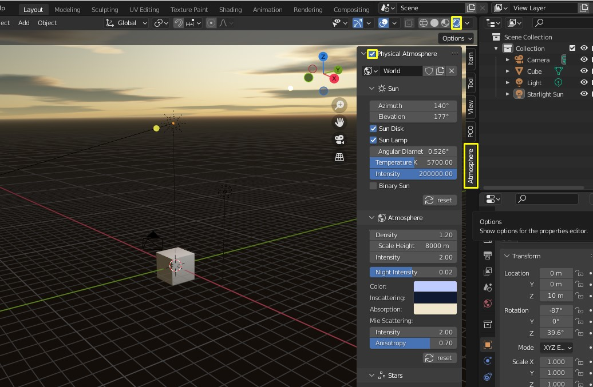
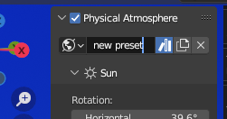
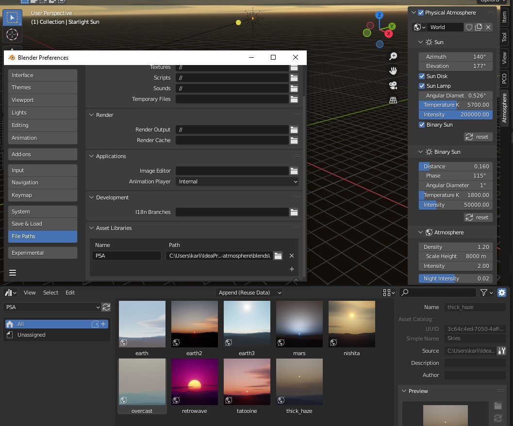

# Getting started

_Physical Starlight and Atmosphere_ (PSA)  is a Blender addon for advanced environmental lighting that provides high quality atmospherics
and lighting, and visual consistency between every object in your scene. It can be installed as any other Blender addon.
## Requirements

Latest _Physical Starlight and Atmosphere_ is supported by [Blender 3.4+](https://www.blender.org/).
Addon versions from v1.2 till 1.6.1 works on [Blender 2.81 - 3.3](https://www.blender.org/).

## Installation

!!! info
    "Physical Starlight and Atmopshere" is only available for purchase on
    [Blendermarket](https://blendermarket.com/products/physical-starlight-and-atmosphere) or [Gumroad](https://gumroad.com/l/PSaA).
    Get your latest version there.

- Download the "physical-starlight-atmosphere-[version here].zip" file.
- Open Blender.
- Go to Edit/Preferences. 
- Choose "Add-ons" tab and press "Install..." button. 
- Locate the .zip file and press "Install Add-on".
- You will see the newly installed add-on, enable it by checking the checkbox. 
- Wait till it registers. Voila!

## First Run
- Locate _Physical Starlight and Atmosphere_ panel in [Sidebar](https://docs.blender.org/manual/en/latest/interface/window_system/regions.html#sidebar)
also called _N Panel_ (You can also find addon panel in the World Properties). Click on the tab _Atmosphere_ to reveal it.
- Enable addon by ticking the uppermost checkbox.

 
!!! important
    To see the sky, you have to be in "Rendered" Viewport Shading mode (click on the 4th sphere in the list up in the right corner of 3D viewport)

!!! summary "What happens when addon is being enabled/disabled?"
    - A couple of shader nodes are imported and dynamically added and connected to the currently active world. When you uncheck the _Physical Atmosphere_ checkbox, these nodes will be removed.
    - Sun lamp `Sarlight Sun` is added. The Sun lamp is used as the main light source to cast shadows from the Sun. When you uncheck the _Physical Atmosphere_ checkbox, if no active PSA instances are found in other worlds it will be removed.

## Preferences
There is no _The One_ way to use this addon. That is why we encourage you to find the way
it works best for you. Addon [preferences panel](img/UI/UI_preferences.png) is located under
`Edit > Preferences > Add-ons`.

### Toolbar Enabled
:octicons-milestone-24: _Default_: `true`

By default, the _Atmosphere_ tab is in the sidebar of Blender 3D viewport (`N` key) and "World Properties" tab in
Properties panel. Setting this to `false` will hide the toolbar. Reveal panel by clicking on _Atmosphere_ tab. 

### Toolbar Label
:octicons-milestone-24: _Default_: `"Atmosphere"`

By default, Toolbar tab for _Physical Starlight and Atmosphere_ is _Atmosphere_. It might be useful to rename it
to something shorter like `PSA` to reduce space the tab is taking. 

### Use ACES color space
:octicons-milestone-24: _Default_: `false`

The Academy Color Encoding System[^1] (ACES) is a color image encoding system created by hundreds of industry professionals. ACES allows for a fully encompassing color accurate workflow, with seamless interchange of high quality motion picture images regardless of source.

### Use real world physical values
:octicons-milestone-24: _Default_: `false`

By default, addon reduces `atmosphere`, `sun` and `stars` intensity values to get the feeling _it just works_, and you 
don't have to modify extra parameter `Exposure` in order to get realistic atmosphere. But very important part of this 
addon is having real world physical values to support visual consistency.

<!-- ### Experimental Features
:octicons-milestone-24: _Default_: `false`

Enables features that may not be fully functional and tested for all cases. Current list of experimental features:

* [Binary Sun](/psa/binary-sun/) -->

[^1]: [https://en.wikipedia.org/wiki/Academy_Color_Encoding_System](https://en.wikipedia.org/wiki/Academy_Color_Encoding_System)

## Presets

Presets allow to store a snapshot of your customized atmosphere settings and return to it later
or use already predefined presets provided by the addon.

!!! info 
    To be able to use PSA predefined presets you have to use Blender version 3.0 and above. 

### This works with PSA version 1.7+
??? summary "If you have used previous versions of Presets"     
    If you have used the previous versions of Presets, you will need to delete the old asset file:
        
    - Open file explorer 
    - Go to: > This PC > Local Disk > Users > /user/ > AppData > Roaming > Blender Foundation > Blender > /your version/ > datafiles > presets > PSA > 

        - Alternatively (for non-Windows users):
        
            - Navigate to Blender preferences and locate ''Asset Libraries''
            <!-- - There you have to find the User Library ''PSA'' or the library's name that corresponds to the presets.blend file -->
            - You have to find the User Library ''PSA'' or the library's name corresponding to the presets.blend file
            - After you have located the library, go to the denoted path and find ''presets.blend''
    - Delete the ''presets.blend'' file.

#### Installing and using presets

1. Install the PSA addon (version 1.7+)
2. Enable the addon 
3. In one of the Blender existing Areas open *Data > Asset Browser*
4. Choose ''PSA'' in the dropdown menu
5. Choose the preset you like and drag it into your scene

### How to make your own presets

1. In the PSA panel rename the world to your custom presets name

    

2. Right-click the world button and mark it as an asset
3. Your asset will now appear in the asset browser (no preview will generate)

<!-- 
Assets allow to store a snapshot of your customized atmosphere settings and return to it later
or use already predefined presets provided by the addon.

!!! info 
    To be able to use PSA predefined assets you have to use Blender version 3.0 and above.

### Importing assets
1. download *assets.blend* file
2. in Blender go to* Edit > Preferences* and open *File Paths* tab
3. Under *Asset Libraries* click + symbol and point to the folder where *assets.blend* file is located.
4. Assign a name to this library

### Using assets
1. In one of the Blender [existing Areas]((https://docs.blender.org/manual/en/3.0/interface/window_system/areas.html#areas))  open *Data > Asset Browser*
2. Under the dropdown select a name you assigned to the library when importing assets.
3. Select an asset and drop it in the view.

 -->

