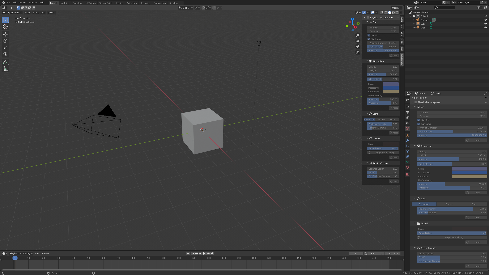
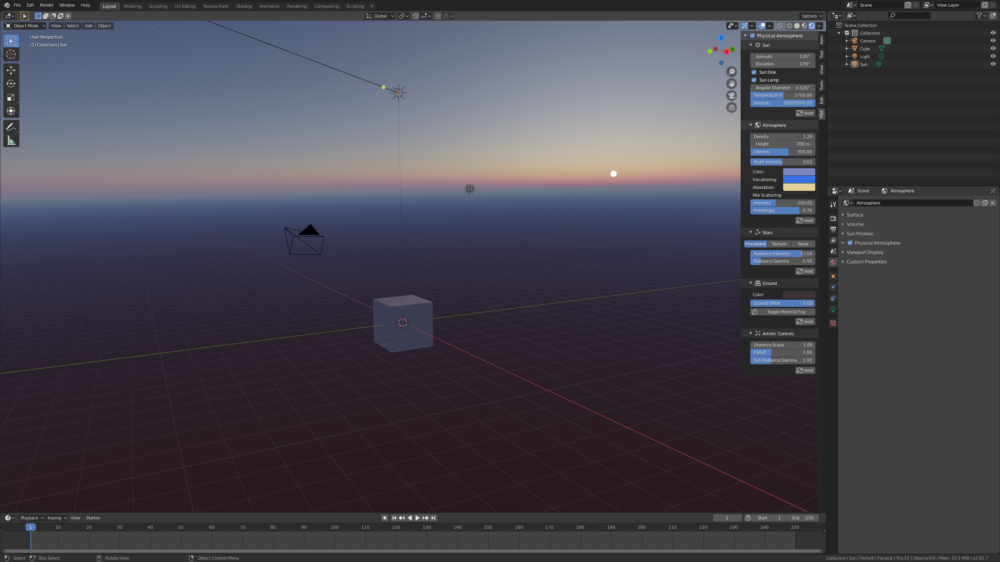
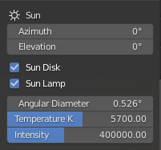

### Part 1: Getting started

Once installation is complete, you are set! 

- By default the "Physical Atmosphere" tab is now in the sidebar of Blender 3D viewport ("N" key) and "World Properties" tab in Properties panel.
Click on the "Physical Atmosphere" tab and you'll see this: 

- If you want, you can disable the sidebar panel, or rename it to something shorter (or longer?)

- Now enable it by ticking the uppermost checkbox "Atmosphere". To see the sky, you have to be in "Rendered" Viewport Shading mode (click on the 4th sphere in the list up in the right corner of 3D viewport)

**Now before we move on, I'll explain what the addon just did by pressing the checkbox.**

- It replaced the default world shader node with "StarlightAtmosphere" node. When you grey out the "Atmosphere" checkbox, it will again set it back to default world.
- It added a Sun lamp. The Sun lamp is used as the main light source to cast shadows from the Sun. When you grey out the "Atmosphere" checkbox, it will remove the Sun.

### UI

You are now greeted by this list of variables to play with. Take a deep breath and have a look at those. It has fancy names like Kelvins, radiance, and absorption, but I use those to somehow standartize the variables. Other softwares and scientific tools use similar naming. Also, few of these will be soon replaced with more artist-friendly variables.

We have divided it into 5 sections - "Sun", "Atmosphere", "Stars", "Ground" and "Artistic Controls". You can hide each of them if you feel the view is getting cluttered. Also notice the "Reset" button after each section, it will reset the values to defaults.

Now let's quickly go through each of those sections.

### Part 2: Sun

Sun is controlled by these 7 variables:

- Sun Azimuth
- Sun Elevation
- Sun Disk checkbox
- Sun Lamp checkbox
- Sun Angular Diameter
- Sun Temperature K
- Sun Radiance Intensity

#####Sun Position

Sun position in the sky is controlled by the first two variables - Azimuth and Elevation. Azimuth moves the Sun horizontally, elevation - vertically. The values are angle in degrees. This is one of many ways you can control Sun position. You can move the Sun also by rotating the Sun object itself or use a SunPosition addon that comes with Blender. These two values are added for convenience if your scene is huge and you have lost the Sun object.

#####Sun Visibility

Now the next two parameters might seem confusing for some.

- Sun Disk checkbox, toggles the visibility of the sun disk in the sky. 
- Sun Lamp checkbox, toggles the Sun Lamp intensity. 

I'll explain why these parameters can be useful. There are few specific cases where you don't want to see the Sun disk visible in the sky or don't want your scene illuminated by a parametric lamp. For example if you use Cycles, you can avoid using a parametric Sun Lamp and use the addon as HDRI.

- By disabling both, you get illumination by the sky only. No direct light.
- Sun disk enabled and Sun Lamp disabled, you essentially get a HDRI. Switch to Cycles and you will see how the Sun Disk is a light source - you get shadows.
- Sun disk disabled and Sun Lamp enabled, you have shadows and direct light, but the sun disk will not be visible in the sky. (can't think of a useful case for this setting)
- Both enabled - you have both, direct light and sun disk in the sky. 

If you compare Cycles renders with Sun Lamp enabled and Sun Lamp disabled, there might not be a visual difference. In Eevee you will see huge difference in lighting and with no parametric light source there will be no shadows. This is because Cycles will sample every point in the sky as a "light source" and you will see shadows, while Eevee only approximates the lighting and uses the sky as a "irradiance map".

#####Sun Disk

- Sun disk size in the sky is controlled by "Angular Diameter" parameter. It also changes the Sun Lamp Angle value for soft shadows. Larger the value, bigger the Sun disk, brighter it gets. 

***NOTE: Right now the Sun disk is a 2D circle with parametric apparent diameter, intensity is multiplied with a limb darkening factor. In future releases Sun will be calculated differently - as a real 3D sphere with actual physical diameter placed reeealy far away, but not at infinity, which will actually allow to travel to the Sun***

- "Temperature K" changes the color of the Sun disk. Bigger the value, bluer the Sun. In theory small Stars are hotter, thus bluer, and big stars colder - redder. I wanted to include the calculation of that, but it would remove artistic control, so left it as a manual variable.

- "Intensity" changes the Sun radiance intensity in Watt·sr/m2.
Default value is 20.0 MegaWatt·sr/m2 (calculated by dividing solar constant with sun disk diameter in steridians)

***NOTE: In future I might add an option to use Lux values***

### Part 3: Atmopshere