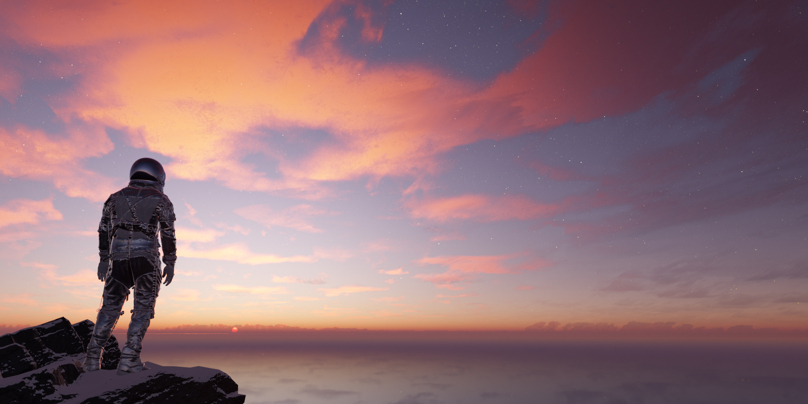
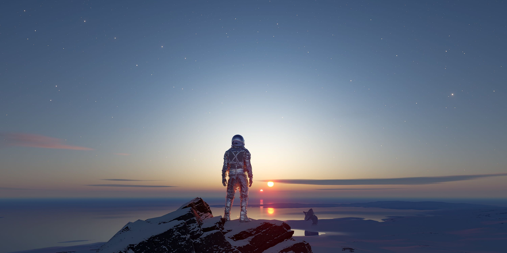
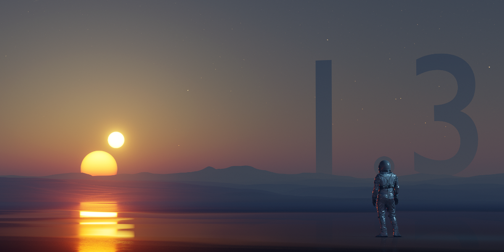

### 1.8.2 <small>- released 27.09.2024</small>

`fixed:`{: .label-fixed } 

- Fixed a bug causing the image to appear overly bright when the sun’s vertical angle was set to 90°, -90°, 270°, or -270°.

### 1.8.1 <small>- released 16.07.2024</small>

`improvements:`{: .label-improvements }

- Added Physical Starlight and Atmosphere abbreviation (PSA) to simplify add-on search in Blender Preferences.

`fixed:`{: .label-fixed } 

- Volume linking is now omitted if no surface is present.
- Improved alpha linking to be mostly automatic.
- Fixed an issue where re-zipping a folder on MacOS resulted in a non-working add-on due to a folder name change.
- Resolved an issue where the binary sun panel would appear if it was enabled, even when the atmosphere was off.

### 1.8.0 <small>- released 25.04.2024</small>

`improvements:`{: .label-improvements }

- Migrated from Asset Browser to a new better and faster preset system.
- UI change to match our other products.

  
### 1.7.1 <small>- released 10.10.2023</small>

`improvements:`{: .label-improvements }

- Updated 'Report a Bug' button in add-on preferences to lead to our Discord channel.
- Conducted general code cleanup.

`fixed:`{: .label-fixed } 

- Resolved an issue that occasionally prevented preset generation when enabling atmosphere for the first time.

### 1.7.0 <small>- released 07.06.2023</small>

`new:`{: .label-new }

- Preset generation from `.json` files and their automatic loading into Blender Asset Browser. 

`fixed:`{: .label-fixed } 

- Cycle fog render performance fix {[Blender: #106770](https://projects.blender.org/blender/blender/issues/106770)}.
- Fixed issues when preset preview wasn't generating correctly.

### 1.6.3 <small>- released 04.04.2023</small>

`fixed:`{: .label-fixed }

- Fixed issue that prevented the use of real world physical values from working correctly. {[#85](https://github.com/PhysicalAddons/physical-starlight-and-atmosphere/issues/85)}

### 1.6.2 <small>- released 15.02.2022</small>

`fixed:`{: .label-fixed }

- Fixed issue that prevented stars from showing up. 
- Cleaned up terminal errors caused by the previous update.

### 1.6.1 <small>- released 23.11.2022</small>

`improvements:`{: .label-improvements }

- Changed star and cloud textures to use a more convenient user interface.
- Added a way to control star temperature.

`fixed:`{: .label-fixed }

- Fixed issue where during animation on the frame change sun jumps or gets stuck. It was done by completely migrating parameters to drivers.
- Fixed issue when stars texture was not affected by radiance gamma and intensity parameters.

### 1.6.0 <small>- released 24.08.2022</small>

`new:`{: .label-new }

- **Clouds now can have a texture** projected as HDRI or planar projection. Procedural clouds can be modified using previous options and additionally seed, detail, dimension and lacunarity parameters (same as Musgrave texture). Textured clouds can be modified by coverage parameter.

- **Refined controls for stars**. Stars amount, scale and seed can now be controlled to get more unique results.

`fixed:`{: .label-fixed }

- Fixed issue when **animating sun** via horizontal and vertical rotation or Sun Position add-on did cause sun to stutter. **Important Note**: in order for old projects to work with PSA v1.6 - disable and re-enable checkbox in the panel.  
- Fixed issue when animating binary sun didn't work.

### 1.5.3 <small>- released 17.08.2022</small>

`fixed:`{: .label-fixed }

- Fixed issue when disabling add-on that had linked Material Fog node resulted in Missing Data-Block node. 

### 1.5.2 <small>- released 01.07.2022</small>

`improvements:`{: .label-improvements }

- Improve experience while using Cloud scale property by giving more control over it.

`fixed:`{: .label-fixed }

- Fixed issue when moving azimuth or elevation values sometimes scene would not be redrawn. This issue also affected animations that animated azimuth and elevation properties. Now instead of using **azimuth** & **elevation** properties, **sun horizontal and vertical rotation** is used. The migration script should ensure swift version migration.

- Fixed issue when preset from the Asset Browser was dropped into the scene, sun position were not updated. 

### 1.5.1 <small>- released 17.03.2022</small>

`improvements:`{: .label-improvements }

- Space out shader nodes when the add-on is enabled.
- Space out shader nodes for existing 10 atmosphere assets.
- Reduced size of assets file.

`fixed:`{: .label-fixed }

- Apply ACES modifier to applied assets.
- Removed reset buttons as they became obsolete after migrating presets to the asset browser.
- Fixed Nishita preset by removing green hue.
- Fixed fog to include physical value multiplier.
- Fixed `toolbar enabled` setting not functioning properly.

### 1.5.0 <small>- released 03.03.2022</small>

`new:`{: .label-new }

- Now storing information in **world data block** instead of scene.
- Now using built in Blender **Asset Browser** instead of custom preset functionality.
- **5 new presets** (assets) - earth2, earth3, overcast, tatooine, thick haze
- Implemented update script which allows without issues to transfer existing projects with older PSA versions to PSA v1.5.0.  

`improvements:`{: .label-improvements }

- Atmosphere is applied to the existing world, instead of creating a new world with a PSA atmosphere.
- Improved garbage collection for Node Groups.  

`fixed:`{: .label-fixed }

- **Fixed Blender crash** that occurred when rendering. {[#43](https://github.com/PhysicalAddons/physical-starlight-and-atmosphere/issues/43)}
- Fixed overexposed Mars preset {[#61](https://github.com/PhysicalAddons/physical-starlight-and-atmosphere/issues/61)}

### 1.4.4-beta <small>- released 14.12.2021</small>

`new:`{: .label-new }

- Added support for ACES color space

`fixed:`{: .label-fixed }

- Fixed issue that after update to v1.4.x gave incorrect values when using 'Use real world physical values' feature
- Fixed issue that gave an TypeError when resetting clouds to defaults using reset button.

`improvements:`{: .label-improvements }

- Binary Sun is now out of the experimental features
- Improved UI for preferences

### 1.4.3-beta <small>- released 07.12.2021</small>

`improvements:`{: .label-improvements }

- Now clouds can be added to the presets.

`fixed:`{: .label-fixed }

- Fixed blender 3.0 compatibility issues.

### 1.3.2 <small>- released 07.12.2021</small>

`fixed:`{: .label-fixed }

- Fixed blender 3.0 compatibility issues.

### 1.4.2-beta <small>- released 26.08.2021</small>

`new:`{: .label-new }

- New UI for Object Fog. Better control over when Object Fog should be applied and when removed. 

`improvements:`{: .label-improvements }

- Improved general add-on performance.
- Reduced RAM used by Object Fog.
- Clouds UI moved to the Atmosphere tab.
- Added extra rotation and location parameters for the Clouds.

`fixed:`{: .label-fixed }

- Fixed issue when rendering animation (hitting F12 key) gets a consistent crash. {[#43](https://github.com/PhysicalAddons/physical-starlight-and-atmosphere/issues/43)}
- Fixed issue when using cloud feature were not enabled when using Cycles rendering engine by default. {[#42](https://github.com/PhysicalAddons/physical-starlight-and-atmosphere/issues/42)}
- Fixed issue when animating sun via Sun Position add-on resulted in incomplete animation. {[#7](https://github.com/PhysicalAddons/physical-starlight-and-atmosphere/issues/7)}
- Alpha fix. {[#45](https://github.com/PhysicalAddons/physical-starlight-and-atmosphere/issues/45)}

### 1.4.1-beta <small>- released 20.06.2021</small>

`improvements:`{: .label-improvements }

- Increase shadow visibility from 200m to 2km.
- Set Experimental features enabled by default.

### 1.4.0-beta <small>- released 17.06.2021</small>

`new:`{: .label-new }

- Procedural Cloud system.

`improvements:`{: .label-improvements }

- Improve animation performance. Now the atmosphere will be redrawn only if UI parameter has changed.
- Now on `Blender > System > Reload Scripts` all add-on scripts are properly reloading.
- Whenever a `.blend` file is loaded in, it correctly loads preset defaults it is based on.

`fixed:`{: .label-fixed }

- Fixed issues when installing a new add-on version on top of the old one results in console errors. {[#31](https://github.com/PhysicalAddons/physical-starlight-and-atmosphere/issues/31)}
- Fixed issue when add-on was not working in multiple scenes. {[#26](https://github.com/PhysicalAddons/physical-starlight-and-atmosphere/issues/26)}
- Fixed issue when _Material Fog_ is active adding a new material caused to lose user made changes in the Shader editor.
  {[#34](https://github.com/PhysicalAddons/physical-starlight-and-atmosphere/issues/34)}

### 1.3.1 <small>- released 16.04.2021</small>

`fixed:`{: .label-fixed }

- Fixed issue that prevents dynamically creating classes in Blender v2.93 and breaks the preset functionality.
  {[#38](https://github.com/PhysicalAddons/physical-starlight-and-atmosphere/issues/38)}

### 1.3.0 <small>- released 13.11.2020</small>

`new:`{: .label-new }   

- Added ability to add or remove Presets (snapshot of your customized atmosphere settings).
- Added 4 presets (_Earth, Mars, Nishita and Retrowave_) that comes default with the add-on installation.
- Added `Binary Sun` (secondary sun) that can be rotated around the `Sun`. For more information check section
[Experimental Features](/psa/customization/#experimental-features)

`improvements:`{: .label-improvements }   

- Now `sun intensity` stays consistent even when increasing `sun radius`.
- `azimuth` and `elevation` slider sensitivity increased
- Improve `ground color` accuracy. Now setting it to black will really mean it's black.

`fixed:`{: .label-fixed }

- Fixed an issue when sun was located near horizon the sun color were washed out.  

### 1.2.3 <small>- released 20.08.2020</small>

`fixed:`{: .label-fixed }

- Fixed an issue where `Toggle Material Fog` button sometimes appears active when it isn't.
- Fixed an issue where when disabling add-on didn't delete all Sun data and left some garbage behind. {[#1](https://github.com/PhysicalAddons/physical-starlight-and-atmosphere/issues/1)}
- Fixed an issue where when rotating sun using gimbal it did a random jump. {[#6](https://github.com/PhysicalAddons/physical-starlight-and-atmosphere/issues/6)}
- Fixed an issue where when animating time using Sun Position add-on gave the same frame in output. {[#7](https://github.com/PhysicalAddons/physical-starlight-and-atmosphere/issues/7)}

### 1.2.2 <small>- released 15.07.2020</small>

`new:`{: .label-new }   

- Add-on now has preferences to enable or disable real world physical values (by default disabled).

`fixed:`{: .label-fixed }       

- Fixed an issue where disabling add-on didn't reset the exposure to defaults {[#8](https://github.com/PhysicalAddons/physical-starlight-and-atmosphere/issues/8)}
- Fixed an issue where when starting the render exposure was being reset {[#11](https://github.com/PhysicalAddons/physical-starlight-and-atmosphere/issues/11)}  

