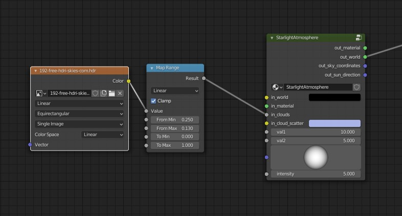

!!! tip ""
    Hey :wave:, first time here? You can find the installation guide and first run in the [getting started](/psa/getting-started/) section.

Take a deep breath and have a look at the user interface. At a glance, it may look a bit complex. It is due to many tweakable parameters and fancy names like *Kelvins*, *radiance*, and *absorption* that we use to standardize variable names.

* [Sun](#sun)
* [Binary Sun](#binary-sun)
* [Atmosphere](#atmosphere)
* [Stars](#stars)
* [Clouds](#clouds)
* [Object fog](#object-fog)
* [Ground](#ground)
* [Artistic Controls](#artistic-controls)

## <svg xmlns="http://www.w3.org/2000/svg" viewBox="0 0 20 20" xml:space="preserve"><path d="M9.492 2.996A.5.5 0 0 0 9 3.504v2.654a3.98 3.98 0 0 0-1.955 1.184L4.854 5.15a.5.5 0 1 0-.707.707l2.32 2.32A3.941 3.941 0 0 0 6 10.004H3.5c-.667 0-.667 1 0 1h2.64a3.98 3.98 0 0 0 1.192 1.96L5.146 15.15c-.471.472.236 1.18.708.708l2.316-2.317c.55.286 1.162.463 1.822.463H10v2.5c0 .667 1 .667 1 0v-2.646a3.982 3.982 0 0 0 1.953-1.194l2.194 2.194c.471.505 1.214-.237.707-.708l-2.325-2.324a3.934 3.934 0 0 0 .458-1.814v-.008H16.5c.667 0 .667-1 0-1h-2.66a3.983 3.983 0 0 0-1.186-1.947l2.2-2.2a.5.5 0 1 0-.708-.707l-2.33 2.33A3.942 3.942 0 0 0 10 6.018V3.504a.5.5 0 0 0-.508-.508zm.5 4.022a2.987 2.987 0 0 1 2.994 2.994 2.986 2.986 0 0 1-2.994 2.992A2.984 2.984 0 0 1 7 10.012a2.986 2.986 0 0 1 2.992-2.994z"/></svg> Sun

### Rotation

    

        Horizontal and vertical movement of the sun.Allow to position sun in specific position creating feeling that it is a morning, midday or an evening.
    

    
<video autoplay loop muted playsinline ><source src="../img/documentation/rotation.mp4" type="video/mp4"></video>

### Sun disk

    

        Choose to see a physical sun disk in the sky.Disk can be removed in a specific edge cases when sun disk in renders appears too bright.
    

    

### Sun lamp

    

        Choose to use a sun lamp or sun disk in the world for illumination.Enabling this will ensure that there are sun shadows present in Eevee, as well as potentially help Cycles render quicker by requiring slightly fewer samples. Disabling this will mostly benefit Cycles renders, where the result will be more accurate with better matching reflections.
    

    

### Angular diameter

    

        The size of the sun disk.Affects shadow and lighting softness and the visual appearance of the sun disk. 
    

    
<video autoplay loop muted playsinline ><source src="../img/documentation/ang_diameter_256x128.mp4" type="video/mp4"></video>

### Temperature K

    

        Physical temperature (in Kelvins) of the sun changes the color of the sun disk.The bigger the value, the bluer the sun.
    

    
<video autoplay loop muted playsinline ><source src="../img/documentation/temperature_256x128.mp4" type="video/mp4"></video>

### Intensity

    

        Intensity of the binary sun emission.Higher intensity makes the sun brighter, thus illuminating the scene more.
    

    
<video autoplay loop muted playsinline ><source src="../img/documentation/intensity_256x128.mp4" type="video/mp4"></video>

### Binary sun

    

        Enables a second sun that is bound to the main sun.
    

    

## <svg xmlns="http://www.w3.org/2000/svg" viewBox="0 0 20 20" xml:space="preserve"><path d="M9.492 2.996A.5.5 0 0 0 9 3.504v2.654a3.98 3.98 0 0 0-1.955 1.184L4.854 5.15a.5.5 0 1 0-.707.707l2.32 2.32A3.941 3.941 0 0 0 6 10.004H3.5c-.667 0-.667 1 0 1h2.64a3.98 3.98 0 0 0 1.192 1.96L5.146 15.15c-.471.472.236 1.18.708.708l2.316-2.317c.55.286 1.162.463 1.822.463H10v2.5c0 .667 1 .667 1 0v-2.646a3.982 3.982 0 0 0 1.953-1.194l2.194 2.194c.471.505 1.214-.237.707-.708l-2.325-2.324a3.934 3.934 0 0 0 .458-1.814v-.008H16.5c.667 0 .667-1 0-1h-2.66a3.983 3.983 0 0 0-1.186-1.947l2.2-2.2a.5.5 0 1 0-.708-.707l-2.33 2.33A3.942 3.942 0 0 0 10 6.018V3.504a.5.5 0 0 0-.508-.508zm.5 4.022a2.987 2.987 0 0 1 2.994 2.994 2.986 2.986 0 0 1-2.994 2.992A2.984 2.984 0 0 1 7 10.012a2.986 2.986 0 0 1 2.992-2.994z"/></svg> Binary Sun

### Distance

    

        Distance from the main sun.
    

    

### Phase

    

        The angle at which the binary sun is placed relative to the main sun.
    

    

### Angular diameter

    

        The size of the binary sun disc.
    

    

### Temperature K

    

        Physical temperature (in Kelvins) of the binary sun changes the color of the binary sun disk.The bigger the value, the bluer the sun.
    

    
<video autoplay loop muted playsinline ><source src="../img/temperature_256x128.mp4" type="video/mp4"></video>

### Intensity

    

        Intensity of the binary sun emission.Changes the binary sun radiance intensity in Watt·sr/m2.
    

    

## <svg xmlns="http://www.w3.org/2000/svg" viewBox="0 0 20 20" xml:space="preserve"><path d="M16.492 2.994a.5.5 0 0 0-.344.15l-1.57 1.57a6.962 6.962 0 0 0-4.576-1.716c-3.86 0-7 3.14-7 7 0 1.75.65 3.35 1.715 4.578l-1.569 1.569a.5.5 0 1 0 .707.707l1.569-1.569a6.966 6.966 0 0 0 4.578 1.715c3.86 0 7-3.14 7-7 0-1.75-.651-3.347-1.717-4.576l1.57-1.57a.5.5 0 0 0-.363-.858zm-6.49 1.004c3.32 0 6 2.68 6 6s-2.68 6-6 6a5.992 5.992 0 0 1-5.467-8.467l.467.467 1 1v2h2v1l1 1v2h2l1-1 1-1v-1l-1-1h-3l-1-1h-1l1-1h1l2-2-1-1h-1l-1-1 .894-.894a6.043 6.043 0 0 1 1.106-.106z"/></svg> Atmosphere

### Density

    

        Control how much atmosphere is present on the planet.For example, 0 is the vacuum of the space, but 1.22 kg/m3 is the atmosphere density for the Earth.
    

    
<video autoplay loop muted playsinline ><source src="../img/documentation/density.mp4" type="video/mp4"></video>

### Scale Height

    

        Determines how high the atmosphere goes in the scene, affecting density distribution.Mostly affects vertical transitions in the atmosphere, where lower scale heights will make effects of changing altitude appear quicker.
    

    
<video autoplay loop muted playsinline ><source src="../img/documentation/scale_height.mp4" type="video/mp4"></video>

### Intensity

    

        Artistical control that affects how bright the atmosphere appears.Atmosphere intensity multiplier.
    

    
<video autoplay loop muted playsinline ><source src="../img/documentation/atmo_intensity.mp4" type="video/mp4"></video>

### Night Intensity

    

        Artistical control that affects how bright the atmosphere appears at night.Atmosphere intensity multiplier.
    

    
<video autoplay loop muted playsinline ><source src="../img/documentation/night_intensity.mp4" type="video/mp4"></video>

### Color

    

        Artistical control that gives a tint to the atmosphere particle.
    

    
<video autoplay loop muted playsinline ><source src="../img/documentation/atmo_color.mp4" type="video/mp4"></video>

### Inscattering

    

        Control how much light is scattered through the particle for each wavelength (RGB).Atmosphere scattering coefficients.
    

    
<video autoplay loop muted playsinline ><source src="../img/documentation/inscattering.mp4" type="video/mp4"></video>

### Absorption

    

        In real life situation, this should be an invert of inscattering value to give a physically accurate appearance.This control is exposed to give more artistic freedom.
    

    
<video autoplay loop muted playsinline ><source src="../img/documentation/absorption.mp4" type="video/mp4"></video>

### Mie Scattering Intensity

    

        Aura around the sun.Light scattering around the sun in the lower atmospheric layer.
    

    
<video autoplay loop muted playsinline ><source src="../img/documentation/mie_intensity.mp4" type="video/mp4"></video>

### Mie Scattering Anisotropy

    

        How concentrated is the light scattering around the sun.
    

    

## <svg xmlns="http://www.w3.org/2000/svg" viewBox="0 0 20 20" xml:space="preserve"><path d="M7.5 3.5A.5.5 0 0 0 7 4v3a.5.5 0 0 0 .5.5h3A.5.5 0 0 0 11 7V4a.5.5 0 0 0-.5-.5zm.5 1h2v2H8zm4.5 5a.5.5 0 0 0-.5.5v3a.5.5 0 0 0 .5.5h3a.5.5 0 0 0 .5-.5v-3a.5.5 0 0 0-.5-.5zm.5 1h2v2h-2zm-8.5 2a.5.5 0 0 0-.5.5v3a.5.5 0 0 0 .5.5h3A.5.5 0 0 0 8 16v-3a.5.5 0 0 0-.5-.5zm.5 1h2v2H5z"/></svg> Stars

### Type

    

        Use procedurally generated stars or image texture for the stars.Procedurally stars are generated using noise texture. When using image texture it is applied using equirectangular projection.
    

    

### Radiance Intensity

    

        Artistic control that affects how bright the stars are.
    

    

### Radiance Gamma

    

        How dense stars appear in the sky.Changes star brightness distribution curve.
    

    

## <svg xmlns="http://www.w3.org/2000/svg" viewBox="0 0 20 20" xml:space="preserve"><path d="M10.69 3.012A4.003 4.003 0 0 0 7 7a.5.5 0 0 0 .016.133 3.973 3.973 0 0 0-1.059.427 3.994 3.994 0 0 0-1.879 4.145A2.998 2.998 0 0 0 3.002 14.1a3.005 3.005 0 0 0 2.672 2.881 3 3 0 0 0 3.152-2.008 3.97 3.97 0 0 0 2.499-.746 3.498 3.498 0 0 0 3.789.377 3.5 3.5 0 0 0-.322-6.357 3.998 3.998 0 0 0-.885-3.996 4.024 4.024 0 0 0-3.217-1.24zm.521.996a2.996 2.996 0 0 1 2.51 4.256.5.5 0 0 0-.053.216.5.5 0 0 0 .387.582 2.498 2.498 0 0 1 .598 4.656 2.499 2.499 0 0 1-2.84-.372.5.5 0 0 0-.203-.12.5.5 0 0 0-.282-.097.5.5 0 0 0-.351.129 3 3 0 0 1-2.399.713.5.5 0 0 0-.543.33.5.5 0 0 0-.097.197 1.994 1.994 0 0 1-2.154 1.49 1.993 1.993 0 0 1-.957-3.598.5.5 0 0 0 .166-.117c.198-.115.418-.2.656-.242a.5.5 0 0 0-.09-.994.5.5 0 0 0-.084.01c-.16.028-.313.075-.463.127a2.992 2.992 0 0 1 5.057-2.346.5.5 0 0 0 .69-.724 3.995 3.995 0 0 0-2.31-1.079C8.302 7.008 8.15 7.01 8 7.01A.5.5 0 0 0 8 7a2.996 2.996 0 0 1 3.211-2.992z"/></svg> Clouds

### Scale

    

        Changes scale of the cloud noise texture.
    

    

### Thickness

    

        Control how opaque clouds appear overall.
    

    

### Coverage

    

        Control minimum and maximum of how much clouds are covering the sky.
    

    

### Self Shadowing

    

        Control the amount of shadows forming on clouds.
    

    

### Directional Power

    

        How much light is concentrated around the sun.
    

    

### Inscattering

    

        Control how much light is scattered through the particle for each wavelength (RGB).Cloud scattering coefficients.
    

    

### Location

    

        Cloud coordinate position offset.
    

    

### Rotation

    

        Cloud coordinate rotation offset.
    

    

!!! tip "Advanced: HDRI clouds"
    1. Open Shader Editor
    2. Add environment texture `Add > Texture > Environment Texture`
    3. Add mask `Add > Converter > Map Range`
    4. Link them as shown in the image below:

    
        

## <svg xmlns="http://www.w3.org/2000/svg" viewBox="0 0 20 20" xml:space="preserve"><path d="M10 3c-3.86 0-7 3.14-7 7s3.14 7 7 7 7-3.14 7-7-3.14-7-7-7zm0 1a5.991 5.991 0 0 1 5.998 5.959C14.887 10.903 12.995 12 10 12v4c-3.32 0-6-2.68-6-6l.002-.043C5.113 10.901 7.003 12 10 12z"/></svg> Object Fog

### Type

    

        Chose manually or automatically to apply fog material node for every material in the scene.Manual allows to chose when fog material node is applied for materials. Auto applies fog material node whenever new material is added to an object.
    

    

### Apply / Clear

    

        Adds or removes fog material from every material in the scene.If user has manually disconnected fog node for material or relinked it in a different way we apply custom property `psa_user_modified` to object. This prevents our script from overriding user changes.
    

    

## <svg xmlns="http://www.w3.org/2000/svg" viewBox="0 0 20 20" xml:space="preserve"><path d="M5.75 3.5a.5.5 0 0 0-.482.37l-3.25 12a.5.5 0 0 0 .482.63h15a.5.5 0 0 0 .482-.63l-3.25-12a.5.5 0 0 0-.482-.37zm.383 1h2.086l-.217 2H5.59zm3.094 0h1.546l.217 2H9.01zm2.554 0h2.086l.541 2h-2.41zm-6.46 3h2.572l-.327 3H4.508zm3.58 0H11.1l.326 3H8.574zm3.206 0h2.573l.812 3h-3.058zm-7.87 4h3.22l-.434 4h-3.87zm4.23 0h3.066l.436 4H8.03zm4.076 0h3.22l1.085 4h-3.871z" /></svg> Ground

### Color

    

        Control the base color of the ground plane.
    

    

### Ground

    

        If enabled, creates an infinite ground plane. Makes the horizon visible.
    

    

### Ground offset

    

        Move the ground plane vertically by offset.Useful for low orbit and aerial shots.
    

    

### Horizon offset

    

        Move only horizon line up or down.
    

    

## <svg xmlns="http://www.w3.org/2000/svg" viewBox="0 0 20 20" xml:space="preserve"><g><path d="M10.488 8.004a.5.5 0 0 0-.346.146L8.996 9.297l1.707 1.707 1.147-1.146a.5.5 0 0 0 0-.708l-1-1a.5.5 0 0 0-.362-.146zm-2.199 2L3.142 15.15a.5.5 0 0 0 0 .708l1 1a.5.5 0 0 0 .708 0l5.146-5.147zM6.488 2.996a.5.5 0 0 0-.492.508v1.5h-1.5a.5.5 0 1 0 0 1h1.5v1.5a.5.5 0 1 0 1 0v-1.5h1.5a.5.5 0 1 0 0-1h-1.5v-1.5a.5.5 0 0 0-.508-.508zm8 .5a.5.5 0 0 0-.492.508v1h-1a.5.5 0 1 0 0 1h1v1a.5.5 0 1 0 1 0v-1h1a.5.5 0 1 0 0-1h-1v-1a.5.5 0 0 0-.508-.508zm0 7.5a.5.5 0 0 0-.492.508v1.5h-1.5a.5.5 0 1 0 0 1h1.5v1.5a.5.5 0 1 0 1 0v-1.5h1.5a.5.5 0 1 0 0-1h-1.5v-1.5a.5.5 0 0 0-.508-.508z"/></g></svg> Artistic Controls

### Distance scalar

    

        Control all distance values globally.
    

    

### Falloff

    

        Control how fast the atmospheric mist changes density.Atmospheric fog distance falloff curve.
    

    

### Sun radiance gamma

    

        Control how intense Sun color appears.Sun color gamma curve.
    

    

