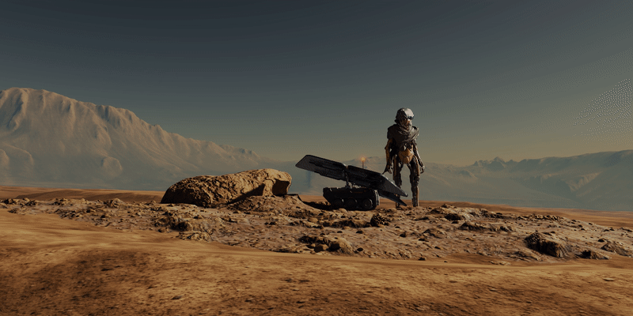

## Interface

Take a deep breath and have a look at the user interface. At first addon, interface may look a bit complex. It is due to many tweakable parameters and fancy names like Kelvins, radiance, and absorption that we use those to standardize variable names.

## General controls

* [Sun]()
* [Atmosphere]()
* [Stars]()
* [Clouds]()
* [Object fog]()
* [Ground]()

<!-- | Parameter      | Description                          | Demo |
| -----------    | ------------------------------------ |      |
| ROTATION       | :material-check:     Fetch resource  |
| SUN DISK       | :material-check:     Fetch resource  |
| `PUT`       | :material-check-all: Update resource |
| `DELETE`    | :material-close:     Delete resource | -->

## Sun

### Rotation
Horizontal - *horizontal movement of the sun

Vertical - *vertical movement of the sun

    
### SUN DISK
choose to see a physical sun disk in the sky

### SUN LAMP
whether to use a sun lamp or sun disk in the world for illumination. *Enabling this will ensure that there are sun shadows present in Eevee, as well as potentially helping Cycles render quicker by requiring slightly less samples. Disabling this will mostly benefit Cycles renders, where the result will be more accurate with better matching reflections.*

### Angular diameter

The size of the sun disk. *Affects shadow and lighting softness and the visual appearance of the sun disk. Temperature K - Physical temperature (in Kelvins) of the sun changes the color of the sun disk. The bigger the value, the bluer the sun.*

### BINARY SUN

a second sun that is bound to the main sun

- ANGULAR DIAMETER - The size of the sun disk.
    
    

    {>>Affects shadow and lighting softness and the visual appearance of the sun disk. *Temperature K* - Physical temperature (in Kelvins) of the sun changes the color of the sun disk. *The bigger the value, the bluer the sun.*<<}

<!-- [{ align=right }](https://via.placeholder.com/300x150) -->

<!-- [{ align=right }](https://via.placeholder.com/300x150) -->
- `INTENSITY` - Intensity of the sun emission. *Higher intensity makes the sun brighter, thus illuminating the scene more.*
- BINARY SUN - a second sun that is bound to the main sun
- DISTANCE - distance from the main sun
*phase* - the angle at which the binary sun is placed relative to the main sun
*angular diameter* - the size of the binary sun disc
*intensity* -  Intensity of the binary sun emission. *Changes the binary sun radiance intensity in Watt·sr/m2.*

ATMOSPHERE (ļoti nepiecišams šis, confusing, no documentation)

*density* - Control how much atmosphere is present on the planet. For example, 0 is the vacuum of the space, but 1.22 kg/m3 is the atmosphere density for the Earth. 
*scale height* - Determines how high the atmosphere goes in the scene, affecting density distribution. *Mostly affects vertical transitions in the atmosphere, where lower scale heights will make effects of changing altitude appear quicker.* 
*intensity* - Artistical control that affects how bright the atmosphere appears. *Atmosphere intensity multiplier*.
*night intensity -* Artistical control that affects how bright the atmosphere appears at night. *Atmosphere intensity multiplier*.
*color -* Artistical control that gives a tint to the atmosphere particle.
*inscattering* - Control how much light is scattered through the particle for each wavelength (RGB). *Atmosphere scattering coefficients.* 

**Absorption** - In real life situation, this should be an invert of inscattering value to give a physically accurate appearance. This control is exposed to give more artistic freedom.  

**Mie scattering:**

Mie scattering - Aura around the sun (do not mix with the lens flare or bloom). Light scattering around the sun in the lower atmospheric layer.

**inscattering** - Intensity of the light scattering around the sun

**Anisotropy** - How concentrated is the light scattering around the sun

STARS

procedural - use simple procedurally generated stars  

texture - use image texture (uses equirectangular projection)
**radiance intensity** - Artistic control that affects how bright the stars are.
**radiance gamma** - How dense stars appear in the sky. *Changes star brightness distribution curve.*

CLOUDS

**Scale** (noise scale)- Changes scale of the cloud noise texture
**Thickness**- Control how opaque clouds appear overall.
**coverage - to-do: *vajadzētu vienu value. nevis max un min.*** Control how much clouds are covering the sky. 

**lighting intensity** - Artistic control that allows control over how much sunlight is affecting the clouds.

**self shadowing** - Control the amount of shadows forming on clouds. 
**directional power** - How much light is concentrated around the sun. 
**inscattering** - Control how much light is scattered through the particle for each wavelength (RGB). *Cloud scattering coefficients.* 

**location -** cloud coordinate position offset
**rotation -** cloud coordinate rotation offset

OBJECT FOG
When enabled for every material adds fog that is using the same parameters as the world.

GROUND - if enabled, creates an infinite ground plane. Makes the horizon visible. 

**color -** control the base color of the ground plane
**ground offset -** Move the ground plane vertically by offset. Useful for low orbit and aerial shots.
**horizon offset** - Move only horizon line up or down. 

ARTISTIC CONTROLS

**Distance scalar** - Control all distance values globally 
**Falloff -** Control how fast the atmospheric mist changes density. *Atmospheric fog distance falloff curve*
**Sun radiance gamma** - Control how intense Sun color appears. *Sun color gamma curve*

addon settings

info about versions

    
ANGULAR DIAMETER - The size of the sun disk.

    

        

        Affects shadow and lighting softness and the visual appearance of the sun disk. *Temperature K* - Physical temperature (in Kelvins) of the sun changes the color of the sun disk. *The bigger the value, the bluer the sun.*

        

        <!--  -->
        
    

    
ANGULAR DIAMETER - The size of the sun disk.

    

        

        Affects shadow and lighting softness and the visual appearance of the sun disk. *Temperature K* - Physical temperature (in Kelvins) of the sun changes the color of the sun disk. *The bigger the value, the bluer the sun.*

        

        
    

