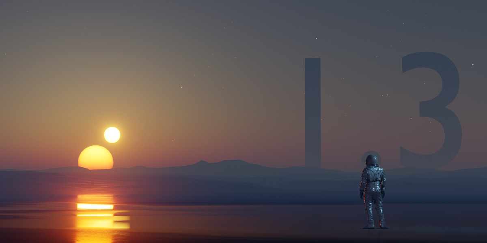

### 1.3.1 <small>- released xx.xx.2021</small>

`new:`{: .label-new }   

`improvements:`{: .label-improvements }   

- Improve animation performance. Now the atmosphere will be redrawn only if UI parameter has changed.
- Now on `Blender > System > Reload Scripts` all addon scripts are properly reloading.
- Whenever a blendfile is loaded it correctly loads preset defaults it is based on.

`fixed:`{: .label-fixed }

- Fixed issues when installing a new addon version on top of the old one results in console errors. {[#31](https://github.com/PhysicalAddons/physical-starlight-and-atmosphere/issues/31)}
- Fixed issue when addon was not working in multiple scenes. {[#26](https://github.com/PhysicalAddons/physical-starlight-and-atmosphere/issues/26)}
- Fixed issue when _Material Fog_ is active adding a new material caused to lose user made changes in the Shader editor.
{[#34](https://github.com/PhysicalAddons/physical-starlight-and-atmosphere/issues/34)}

### 1.3.0 <small>- released 13.11.2020</small>

`new:`{: .label-new }   

- Added ability to add or remove Presets (snapshot of your customized atmosphere settings).
- Added 4 presets (_Earth, Mars, Nishita and Retrowave_) that comes default with the addon installation.
- Added `Binary Sun` (secondary sun) that can be rotated around the `Sun`. For more information check section
[Experimental Features](/psa/customization/#experimental-features)

`improvements:`{: .label-improvements }   

- Now `sun intensity` stays consistent even when increasing `sun radius`.
- `azimuth` and `elevation` slider sensitivity increased
- Improve `ground color` accuracy. Now setting it to black will really mean it's black.

`fixed:`{: .label-fixed }

- Fixed an issue when sun was located near horizon the sun color were washed out.  

### 1.2.3 <small>- released 20.08.2020</small>

`fixed:`{: .label-fixed }

- Fixed an issue where `Toggle Meterial Fog` button sometimes appears active when it isn't.
- Fixed an issue where when disabling addon didn't delete all Sun data and left some garbage behind. {[#1](https://github.com/PhysicalAddons/physical-starlight-and-atmosphere/issues/1)}
- Fixed an issue where when rotating sun using gimbal it did a random jump. {[#6](https://github.com/PhysicalAddons/physical-starlight-and-atmosphere/issues/6)}
- Fixed an issue where when animating time using Sun Position addon gave the same frame in output. {[#7](https://github.com/PhysicalAddons/physical-starlight-and-atmosphere/issues/7)}

### 1.2.2 <small>- released 15.07.2020</small>

`new:`{: .label-new }   

- Addon now has preferences to enable or disable real world physical values (by default disabled).

`fixed:`{: .label-fixed }       

- Fixed an issue where disabling addon didn't reset the exposure to defaults {[#8](https://github.com/PhysicalAddons/physical-starlight-and-atmosphere/issues/8)}
- Fixed an issue where when starting the render exposure was being reset {[#11](https://github.com/PhysicalAddons/physical-starlight-and-atmosphere/issues/11)}  

